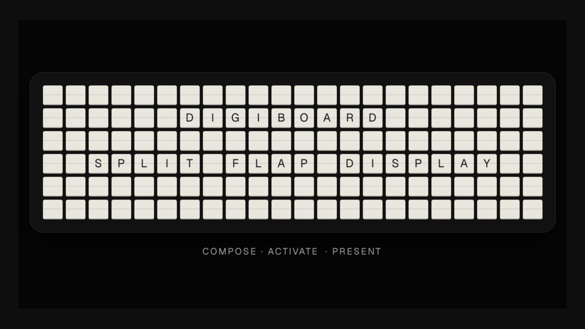

# Digiboard

A digital split-flap message board inspired by [Vestaboard](https://www.vestaboard.com/). Compose a message, hit Activate, and watch each character roll into place with a mechanical flutter — optionally with sound.



> A live deployment is coming soon. For now, the app runs locally with no accounts, API keys, or external services.

## Features

- **Fixed-grid board** — flagship 6×22 or note 3×15, with light and dark tile themes.
- **Composer** — draft messages with line/block/vertical alignment, color chips, symbols, and blank bits; the board only changes when you activate.
- **Split-flap animation** — each changed cell rolls through intermediate glyphs with a diagonal stagger; adjacent-glyph changes (a clock ticking over) advance with a single flap. Respects reduced motion.
- **Live programs** — clock, countdown, and preset rotation, rendered as pure functions of time so every tab shows the same thing at the same moment.
- **Presentation mode** — `/present` shows just the board scaled to the viewport, holds a screen wake lock, auto-hides chrome, and mirrors whatever the composer tab activates (state syncs via localStorage).
- **Extras** — presets, message history, shuffle test, copy-as-JSON, synthesized mechanical sound (no audio assets).

## Getting started

```bash
pnpm install
pnpm dev
```

Open [http://localhost:3000](http://localhost:3000) for the composer, or [http://localhost:3000/present](http://localhost:3000/present) for a full-screen sign.

## Commands

```bash
pnpm test        # vitest unit tests
pnpm lint        # eslint
pnpm typecheck   # TypeScript
pnpm build       # production build
```

## Keyboard shortcuts

- `Enter` activates the current draft; `Shift+Enter` inserts a newline.
- `F` toggles fullscreen in presentation mode.
- `Esc` exits fullscreen first, then returns to the composer.

## Structure

- `lib/` — pure, tested logic: board model, text layout engine, character set, special cells, programs, sound synthesis.
- `components/board/` — the rendering layer: board grid, per-cell flap animation, composer, tools, and hooks.
- `app/` — the composer, presentation route, metadata, and generated social artwork.

Built with Next.js, React, Tailwind, and [slot-text](https://www.npmjs.com/package/slot-text).

Open source under the [MIT License](LICENSE).
